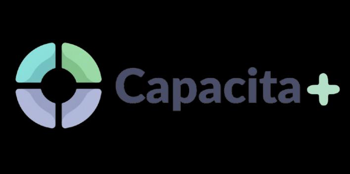
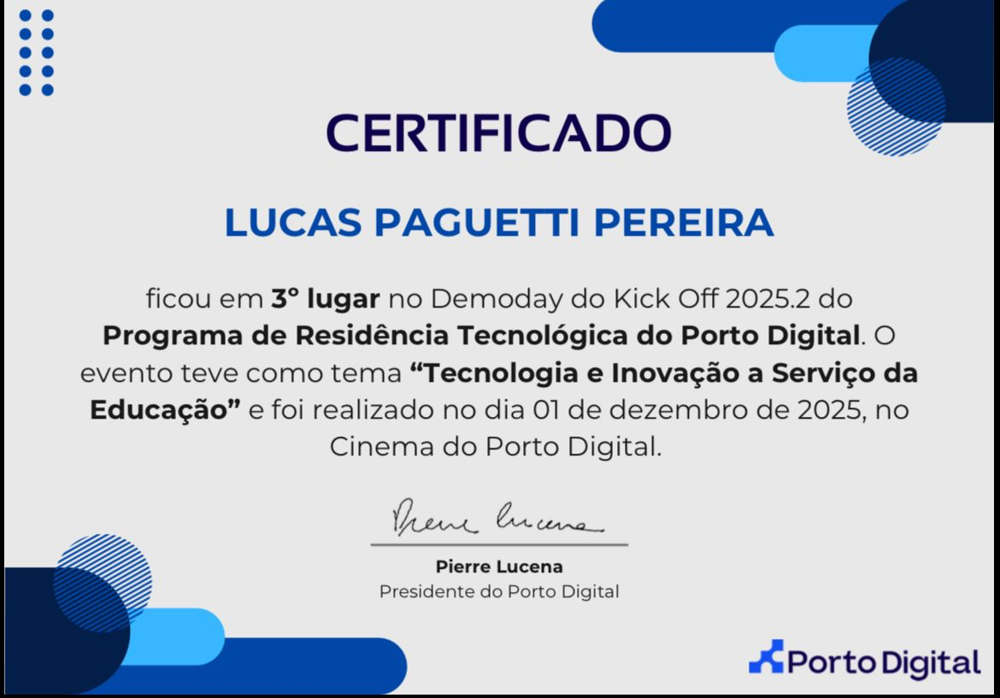
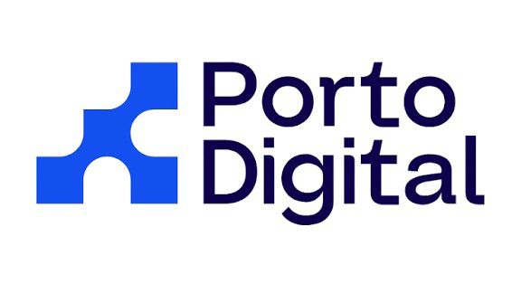

<h1 align="center">
  🎓 Certificado do Porto Digital  
   
  <small>Evento – Residência Tecnológica 2025.2</small>
</h1>

  

<h2 align="center">📘 Projeto: Capacita+</h2>
<h3 align="center">👥 Integrantes</h3>

<ul align="center">
  <li>
    Lucas Paguetti Pereira (Eu) —
    <a href="https://github.com/wqiluc" target="_blank">GitHub</a> |
    <a href="https://www.linkedin.com/in/lucaspaguettipereira/" target="_blank">LinkedIn</a>
  </li>

  <li>
    Eduardo de Souza Cavalcanti Junior —
    <a href="https://github.com/eduardo-scavalcanti" target="_blank">GitHub</a> |
    <a href="https://www.linkedin.com/in/eduardoscavalcantij/" target="_blank">LinkedIn</a>
  </li>

  <li>
    Cauã Henrique Melo Almeida —
    <a href="https://www.linkedin.com/in/caua-henrique-melo-almeida-b83744380/" target="_blank">LinkedIn</a>
  </li>

  <li>
    João Pedro Arruda —
    <a href="https://www.linkedin.com/in/joão-pedro-arruda-guimarães-157952287/" target="_blank">LinkedIn</a>
  </li>

  <li>
    Lucas Moreira de Carvalho —
    <a href="#" target="_blank">LinkedIn</a>
  </li>

  <li>
    Maria Eduarda Vasconcelos —
    <a href="https://www.linkedin.com/in/maria-eduarda-vasconcelos-5877401b7/" target="_blank">LinkedIn</a>
  </li>

  <li>
    Matheus Henrique - @Mateus Diniz
  </li>

  <li>
    Pablo Tamborini Nogueira —
    <a href="https://www.linkedin.com/in/pablo-tamborini-nogueira/?miniProfileUrn=urn%3Ali%3Afs_miniProfile%3AACoAAGDpIH4BiVEiQaMTWGOSHHTlasgaxx1lHbM" target="_blank">LinkedIn</a>
  </li>

  <li>
    Victor Barros Roma —
    <a href="https://www.linkedin.com/in/victor-roma-38035a111/" target="_blank">LinkedIn</a>
  </li>

  <li>
    Victor José Paes e Silva —
    <a href="https://www.linkedin.com/in/viictorpaes/" target="_blank">LinkedIn</a>
  </li>
</ul>

Inspirado na <strong>ODS 4 — Educação de Qualidade</strong> e no uso consciente da 
<strong>Tecnologia</strong>, o <strong>Capacita+</strong> é um aplicativo idealizado para apoiar 
<strong>docentes, instituições de ensino e demais agentes do meio acadêmico</strong>.

Sua proposta central é auxiliar na construção de <strong>linhas de estudo personalizadas</strong>, 
considerando as necessidades individuais de cada aluno, com foco especial em estudantes com 
<strong>neurodivergências</strong>.

Entre os perfis atendidos pela plataforma, destacam-se:

<ul>
  <li>🧠 Transtorno do Déficit de Atenção e Hiperatividade (<strong>TDAH</strong>)</li>
  <li>🧩 Transtorno do Espectro Autista (<strong>TEA</strong>)</li>
  <li>📖 Dislexia</li>
  <li>🧮 Discalculia</li>
</ul>

Por meio da tecnologia, o Capacita+ busca promover <strong>inclusão, equidade e qualidade no processo educacional</strong>, 
possibilitando que cada estudante aprenda no seu próprio ritmo, de forma mais acessível e eficiente.

A seguir, apresento o meu <strong>certificado de 3º lugar</strong>, conquistado juntamente com minha equipe 
entre os squads participantes da <strong>Residência Tecnológica</strong>.

  

<h3 align="center">🔗 Publicação:</h3>

  

  <em>Clique para visualizar a publicação (feita por Eduardo de Souza Cavalcanti Junior) no LinkedIn</em>

  

