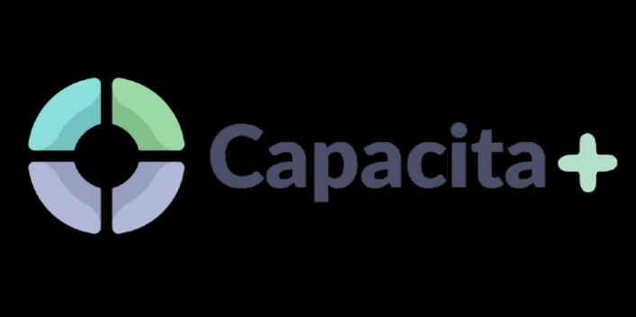
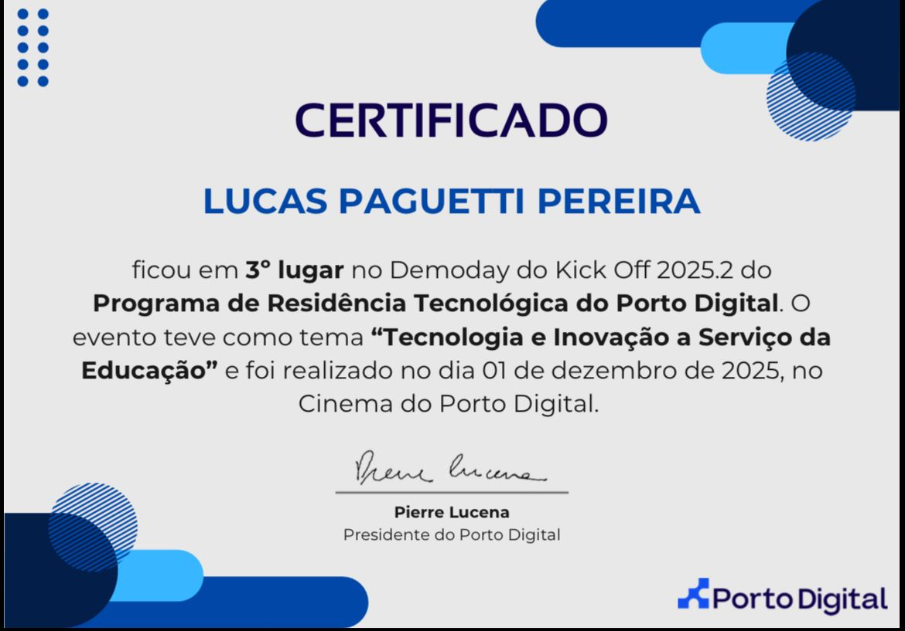
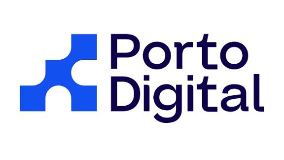

<h1 align="center">
  🎓 Certificado do Porto Digital  
   
  <small>Evento – Residência Tecnológica 2025.2</small>
</h1>

  

<h2 align="center"><b>MVP do Capacita+ (v1.0.0)</b> 
</h2>

<a href="https://github.com/viictorpaes/Capacita-Mais">🔗 Ver MVP ==> </a>

Plataforma educacional inclusiva para alunos neurodivergentes.

   
  
  
  
  
  
  
  
  
  
  
  
  
  
   
  
  
  

<h2 align="center"> Arquitetura do Repositório (simplificada) 
</h2>

<pre>
Certificado-Porto-Digital-CapacitaMais/
├── img/
│   ├── Certificado_PortoDigital.jpeg   
│   ├── logoporto.jpeg 
│   └── logoprojeto.jpeg 
└── README.md 
</pre>

<h3 align="center">👥 Integrantes</h3>
<ul>
  <li><b>Lucas Paguetti Pereira (Eu)</b>  </li>
  <li>Eduardo de Souza Cavalcanti Junior  </li>
  <li>Cauã Henrique Melo Almeida </li>
  <li>João Pedro Arruda Guimarães  </li>
  <li>Lucas Moreira de Carvalho</li>
  <li>Maria Eduarda Vasconcelos  </li>
  <li>Mateus Henrique Diniz da Silva</li>
  <li>Pablo Tamborini Nogueira </li>
  <li>Victor Barros Roma  </li>
  <li>Victor José Paes e Silva  </li>
</ul>

Inspirado na <strong>ODS 4 — Educação de Qualidade</strong> e no uso consciente da 
<strong>Tecnologia</strong>, o <strong>Capacita+</strong> é um aplicativo idealizado para apoiar 
<strong>docentes, instituições de ensino e demais agentes do meio acadêmico</strong>.

Sua proposta central é auxiliar na construção de <strong>linhas de estudo personalizadas</strong>, 
considerando as necessidades individuais de cada aluno, com foco especial em estudantes com 
<strong>neurodivergências</strong>.

Entre os perfis atendidos pela plataforma, destacam-se:

<ul>
  <li>🧠 Transtorno do Déficit de Atenção e Hiperatividade (<strong>TDAH</strong>)</li>
  <li>🧩 Transtorno do Espectro Autista (<strong>TEA</strong>)</li>
  <li>📖 Dislexia</li>
  <li>🧮 Discalculia</li>
</ul>

Por meio da tecnologia, o Capacita+ busca promover <strong>inclusão, equidade e qualidade no processo educacional</strong>, 
possibilitando que cada estudante aprenda no seu próprio ritmo, de forma mais acessível e eficiente.

A seguir, apresento o meu <strong>certificado de 3º lugar</strong>, conquistado juntamente com minha equipe 
entre os squads participantes da <strong>Residência Tecnológica</strong>.

  

<h3 align="center">🔗 Publicação:</h3>

  

  <em>Clique para visualizar a publicação (feita por Eduardo de Souza Cavalcanti Junior) no LinkedIn</em>

  

